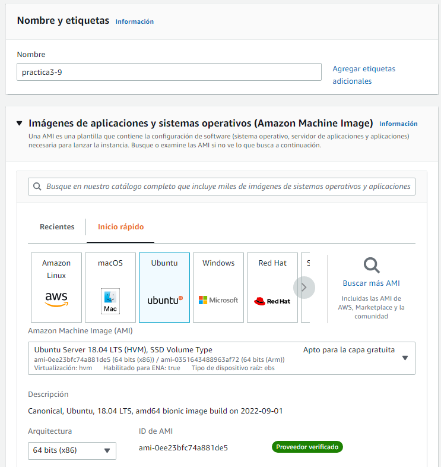
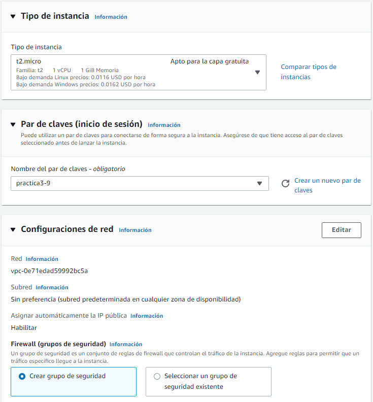
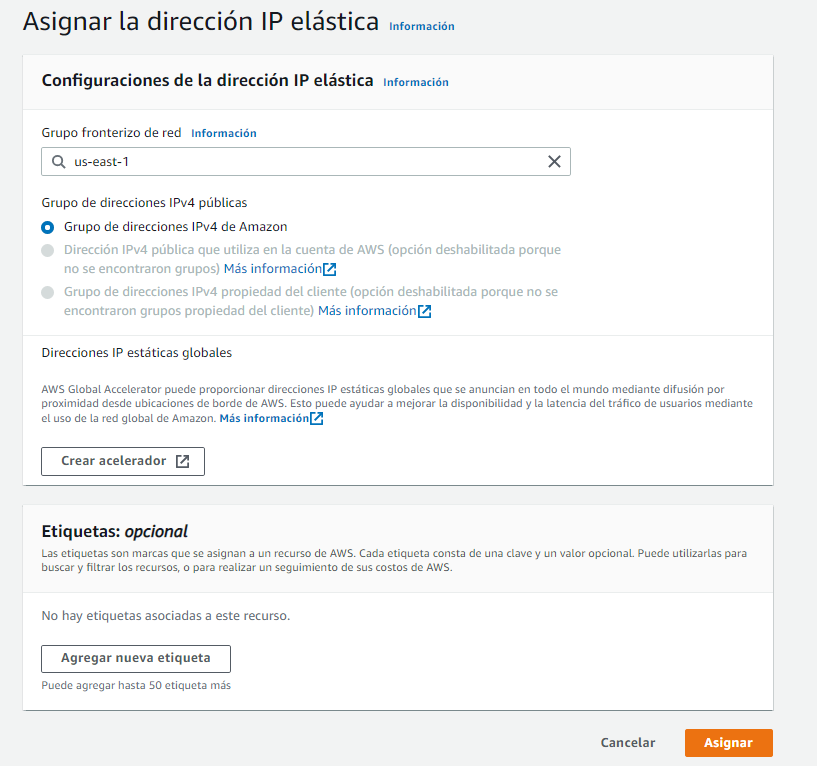
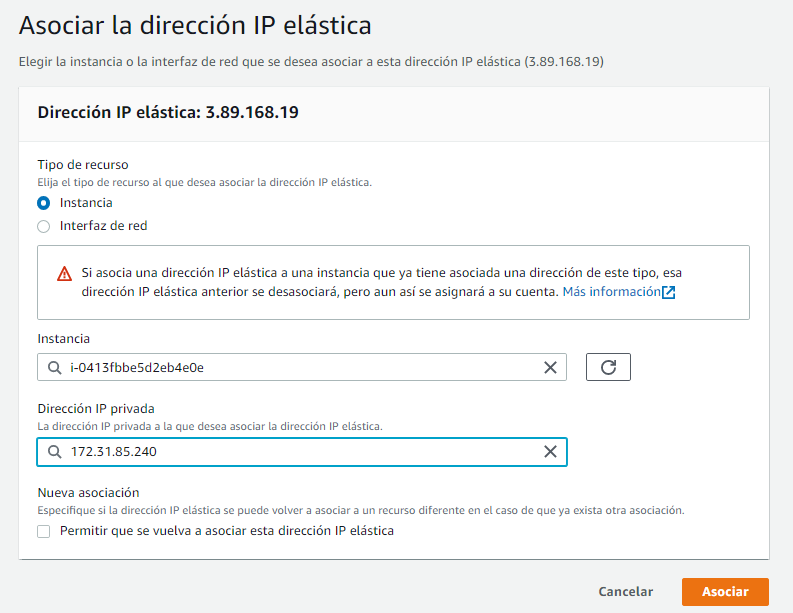
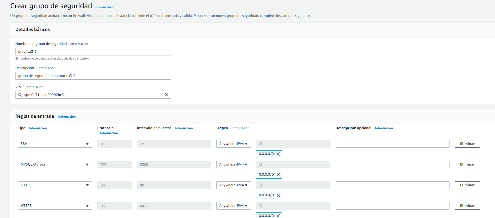
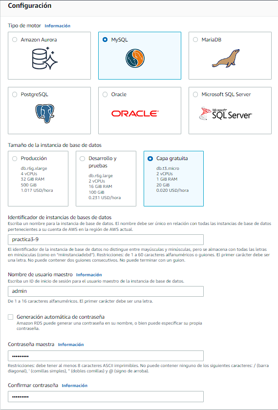
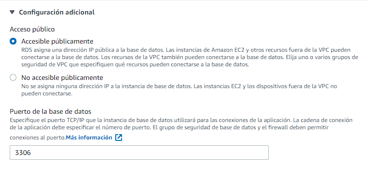
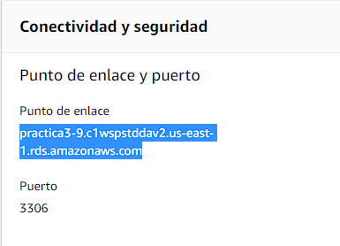
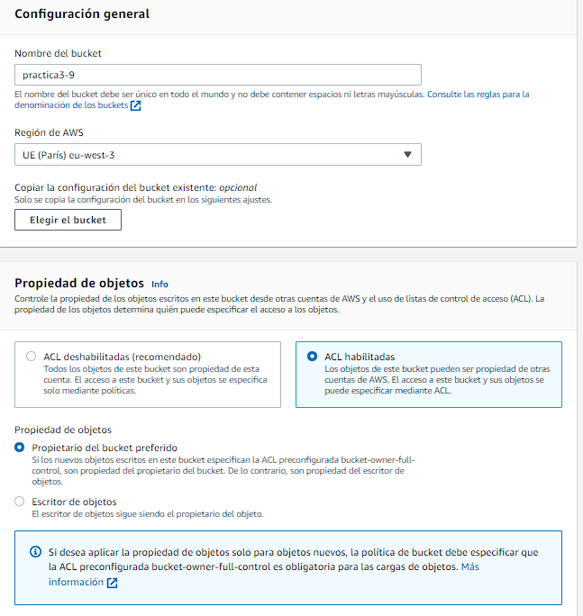
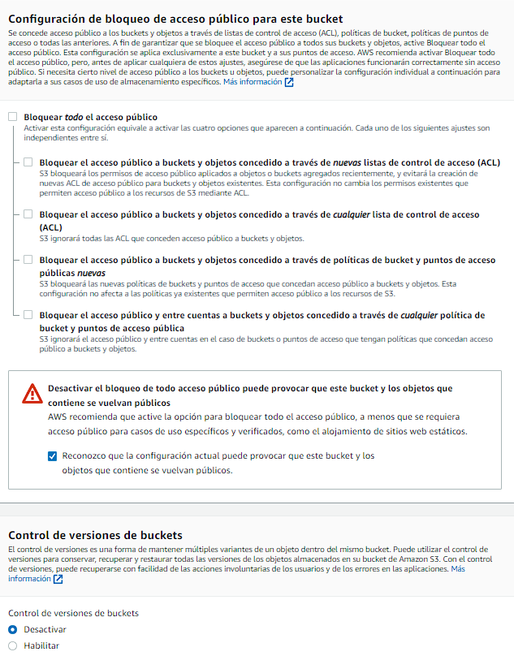

# Práctica 3.9: Despliegue web con bases de datos en AWS. Nivel básico.

## EC2
Lanzaremos una instancia EC2.
Le pondremos la siguiente configuración:

La imagen del SO sera un Ubuntu Server 18.04.

 Contará con una arquitectura de t2.micro y crearemos un par de claves de inicio de sesión.

Asignaremos una IP elastica.

Asociamos la IP elastica.

Creamos el grupo de seguridad con las siguientes reglas de entradas.

## RDS
Lanzaremos una instancia RDS.
Le pondremos la siguiente configuración:
Tendrá un motor MySql y el tamaño será el que nos ofrece la capa gratuita, que en este caso es una t3.micro que tiene 2 CPUs y 1Gb de RAM.

También tendrá practica3-9 como nombre y el usuario maestro será admin. La contraseña que le pondremos sera Root1234$ que es la indicada en la práctica.

También cambiaremos en configuración adicional el acceso público y lo pondremos accesible públicamente.

El ounto de enlace es practica3-9.c1wspstddav2.us-east-1.rds.amazonaws.com y lo usaremos para conectarnos a la EC2.

## S3
Lanzamos una instancia S3.
Le haremos las siguientes modificaciones al crearla:

Le ponemos la región de AWS más cercana, la propiedad de objetos la habilitamos, y por último desmarcamos la casilla para bloquear el acceso público (desbloqueamos el acceso público).

